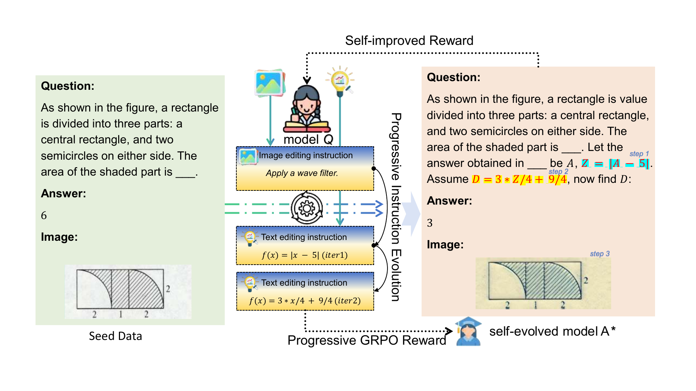

# EvolvedGRPO

**EvolvedGRPO: Unlocking Reasoning in LVLMs via Progressive Instruction Evolution** (NeurIPS 2025).

This repository contains the EasyR1 answer-model framework, the EasyQ1 question-generator framework, data evolution code, and single-node training launchers. Evaluation scripts, benchmark datasets, pretrained weights, generated datasets, and checkpoints are not included.

[](image.pdf)

As image editing models have advanced, we move away from the previous approach of orchestrating various traditional image editing tools and instead adopt a unified Qwen-Image-Edit-2511-based framework, using Qwen2.5-VL-7B as the intelligent understanding component.

## Training workflow

Two Qwen2.5-VL-7B models evolve together:

- `A`: the answer model, trained with EasyR1.
- `Q`: the question generator, trained with EasyQ1.
- Text evolution adds one connected mathematical follow-up.
- Image evolution edits visual appearance while preserving the answer.

The multi-round pipeline is:

```text
D1 -> A1 -> Q1 -> D2 -> A2 -> Q2 -> ... -> Dk -> Ak -> Qk
```

Round 1 uses the original MMK12 data. Each later dataset is built once from the immediately preceding round, using 90% text edits and 10% image edits. Failed edits retain the preceding sample, so the dataset size remains fixed.

> **Guided evolution.** The current implementation relies on a vision-language model to generate evolution instructions autonomously. To target stronger reasoning improvements, instruction generation can be conditioned on explicit guidance: provide an edit category (for example, *content expansion* or *style transformation*) when generating image-edit instructions, and provide a target knowledge concept or reasoning cue (for example, one derived with PromptCoT) when generating text-augmentation instructions. These controls are optional extensions and are not enabled by default in the released code.

## Repository layout

```text
EasyR1/                         answer-model training framework
EasyQ1/                         question-generator training framework
data_augmentation/              dataset evolution and training launchers
dataset/                        user-provided training and validation data
augmentation_env.sh             environment and model bootstrap
install_augmentation_env.sh     standalone installer
view_training_logs_local.sh     offline TensorBoard launcher
image.pdf                       method overview
```

This repository intentionally contains no `eval/` directory or benchmark-evaluation code.

## Requirements

- Linux x86_64 and Python 3.10
- One server with 8 NVIDIA A800 80GB GPUs
- NVIDIA driver compatible with CUDA 12.4
- Enough repository-local storage for the environment, base models, evolved datasets, and checkpoints

The installer creates `.venv-augmentation/` inside the repository and does not modify Conda `base`.

## Installation

```bash
git clone <your-repository-url> EvolvedGRPO
cd EvolvedGRPO

# Optional for authenticated Hugging Face downloads.
export HF_TOKEN="hf_your_token"

source ./augmentation_env.sh
```

The bootstrap installs the pinned runtime and downloads:

- `Qwen/Qwen2.5-VL-7B-Instruct`
- `Qwen/Qwen-Image-Edit-2511`
- `openai/clip-vit-large-patch14`

For every new shell, activate the environment with:

```bash
source ./augmentation_env.sh
```

## Data preparation

MMK12 is not redistributed. Prepare the following directories:

```text
dataset/train_original/data.json
dataset/train_original/images/...
dataset/validation/data.json
dataset/validation/images/...
```

Each row in `data.json` contains one image:

```json
{
  "id": "sample-000001",
  "image": "images/sample-000001.png",
  "problem": "What is the value shown in the diagram?",
  "answer": "6"
}
```

Validate the data before training:

```bash
python data_augmentation/validate_multimodal_dataset.py \
  dataset/train_original --expected-rows 15616

python data_augmentation/validate_multimodal_dataset.py \
  dataset/validation
```

See [`dataset/README.md`](dataset/README.md) for the complete schema.

## Run multi-round training

```bash
source ./augmentation_env.sh
bash data_augmentation/run_multiround_coevolution_8gpu.sh <rounds>
```

Replace `<rounds>` with the required number of evolution rounds. The launcher sequentially builds datasets and trains `A1...Ak` and `Q1...Qk` on all eight GPUs. It also cleans up Ray, vLLM, and CUDA processes between stages.

Rerun the same command after interruption; completed datasets and valid checkpoints are reused automatically.

## Outputs

The run directory contains evolved datasets, `A1...Ak` answer models, `Q1...Qk` question generators, checkpoints, and a `models.env` path index.

Training logs are stored locally. Start TensorBoard with:

```bash
bash ./view_training_logs_local.sh
```

## Citation

```bibtex
@inproceedings{shen2025evolvedgrpo,
  title     = {EvolvedGRPO: Unlocking Reasoning in LVLMs via Progressive Instruction Evolution},
  author    = {Shen, Zhebei and Yu, Qifan and Li, Juncheng and Ji, Wei and Chen, Qizhi and Tang, Siliang and Zhuang, Yueting},
  booktitle = {Advances in Neural Information Processing Systems},
  year      = {2025}
}
```
